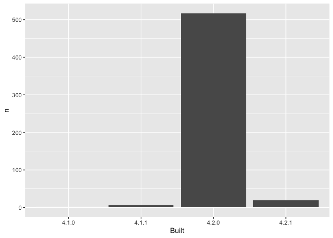

03_make-barchart-packages.R
================
2022-07-26

``` r
## remember to restart R here!

## make a barchart from the frequency table in data/add-on-packages-freqtable.csv

## read that csv into a data frame
## hint: readr::read_csv() or read.csv()
## idea: try using here::here() to create the file path

apt_freqtable<-readr::read_csv("add-on-packages-freqtable.csv")
```

    ## Rows: 6 Columns: 3
    ## ── Column specification ────────────────────────────────────────────────────────
    ## Delimiter: ","
    ## chr (1): Built
    ## dbl (2): n, prop
    ## 
    ## ℹ Use `spec()` to retrieve the full column specification for this data.
    ## ℹ Specify the column types or set `show_col_types = FALSE` to quiet this message.

``` r
## if you use ggplot2, code like this will work:

library(ggplot2)

ggplot(apt_freqtable, aes(x = Built, y = n)) +
  geom_col()
```

<!-- -->

``` r
## write this barchart to figs/built-barchart.png
## if you use ggplot2, ggsave() will help
## idea: try using here::here() to create the file path

ggsave("built-barchart.png")
```

    ## Saving 7 x 5 in image

``` r
## YES overwrite the file that is there now
## that's old output from me (Jenny)
```
